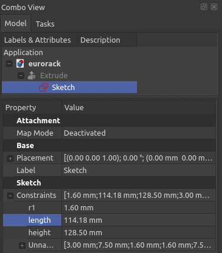
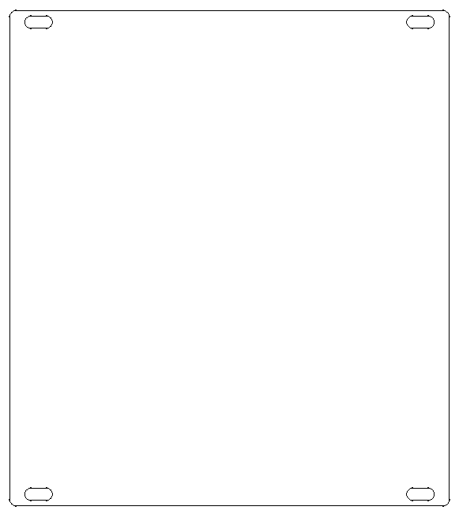
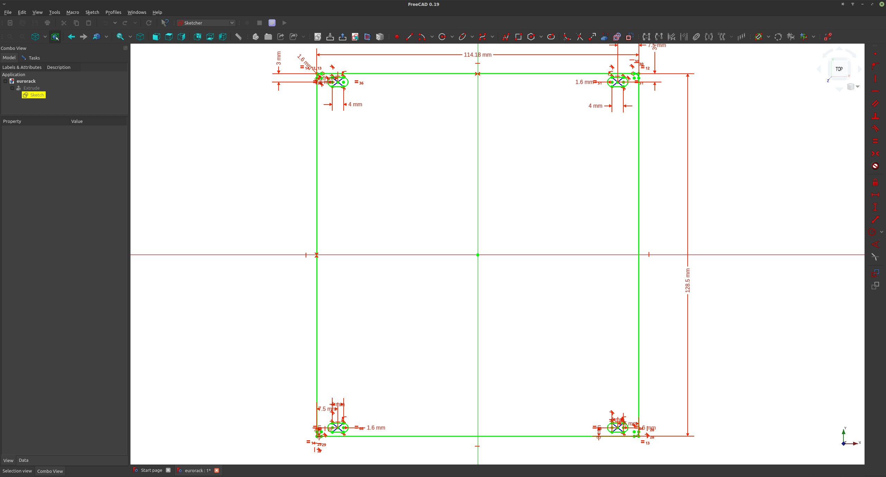

# freecad eurorack panel
fully-constrained parametric freecad sketch for eurorack panel

* Select ```"Sketch"```
* Select Data tab in the property viewer
* Expand ```Constraints```
* Edit ```length``` to select your horizonal pitch 
  * ```(for eurorack, length = hp * 5.08mm)```




