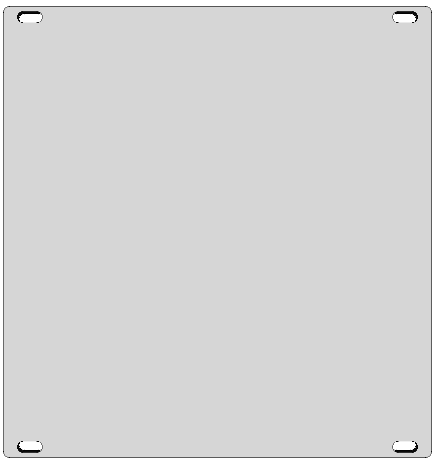
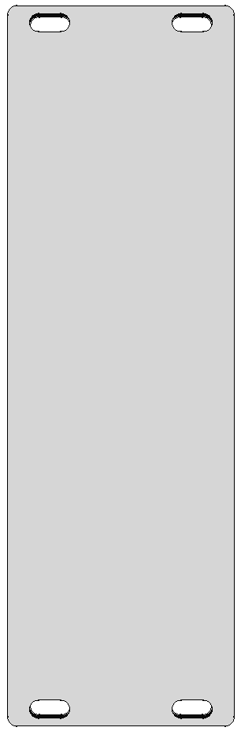

# freecad eurorack panel
fully-constrained parametric freecad sketch for eurorack panel

* Select ```"Sketch"```
* Select Data tab in the property viewer
* Expand ```Constraints```
* Edit ```length``` to select your horizonal pitch 
  * for eurorack: ```length = hp * 5.08mm```


* sketch


* length = 121.92mm (24 HP)



* length = 40.64mm (8 HP)



* screenshot


